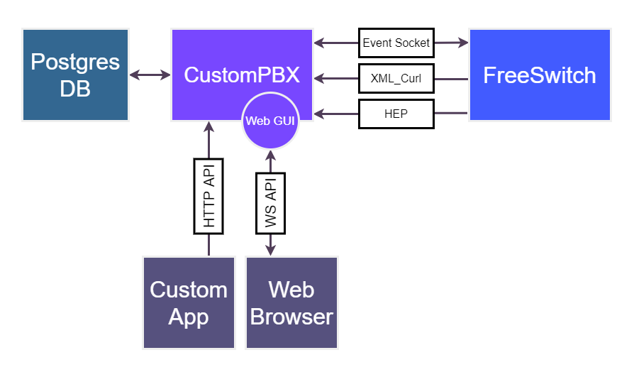

# CustomPBX documentation
### FreeSwitch API and Web Graphical user interface (GUI)
CustomPBX (under development) is API server and Web GUI for FreeSWITCH. Providing pure FreeSWITCH experience and can be installed on existing systems with import existing configuration. Built in [the single binary file](https://github.com/CustomPBX/cpbx/tree/master/bin).

Requirements:  
OS Linux (amd64)  
FreeSWITCH  
Postgres  

1. [Installation](install.md)
2. [Features](features.md)
3. [API Documentation](https://zusrut.github.io/slate/)
4. [Compiled CustomPbx binary file](https://github.com/CustomPBX/cpbx/tree/master/bin)

